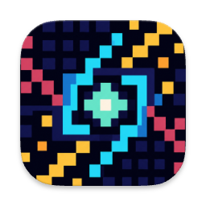
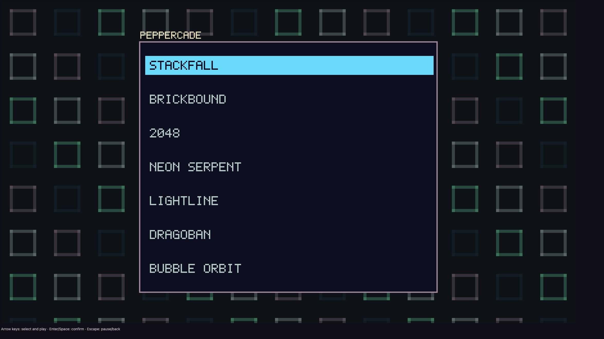
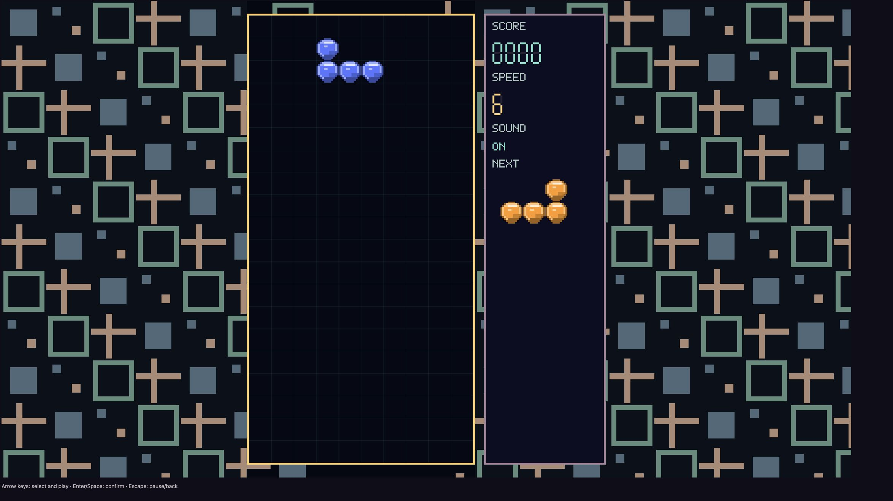
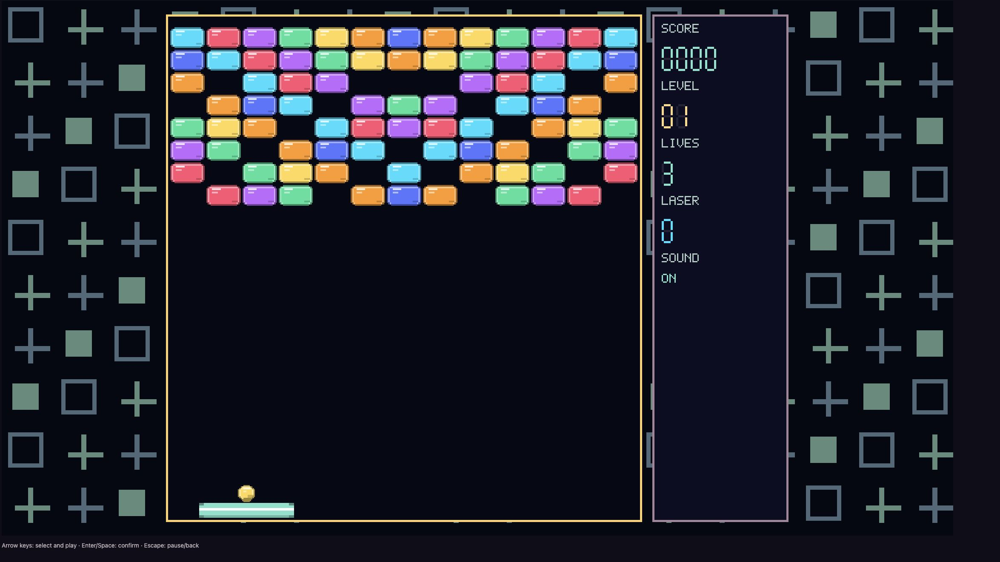
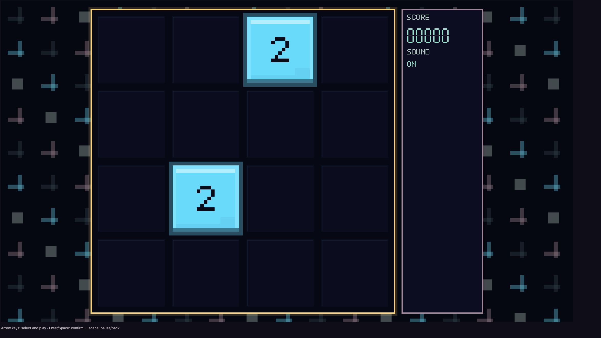
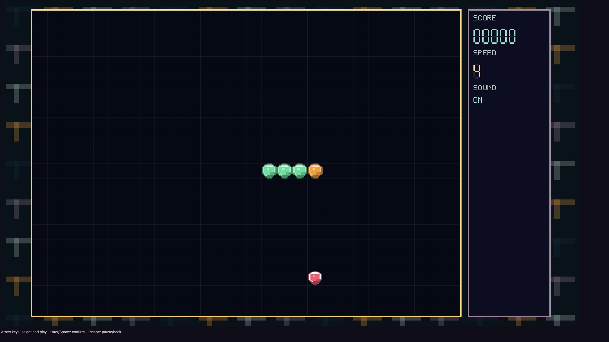
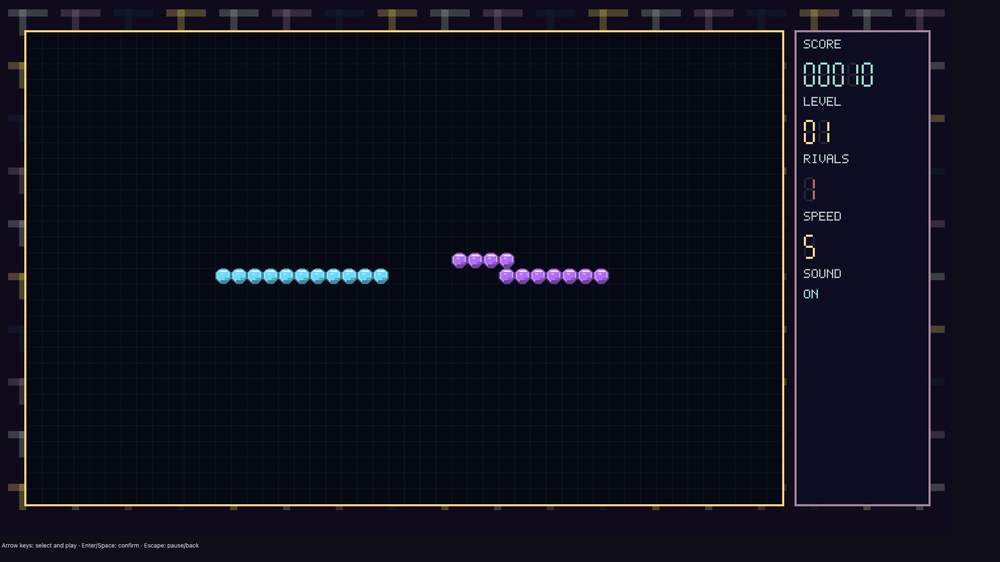
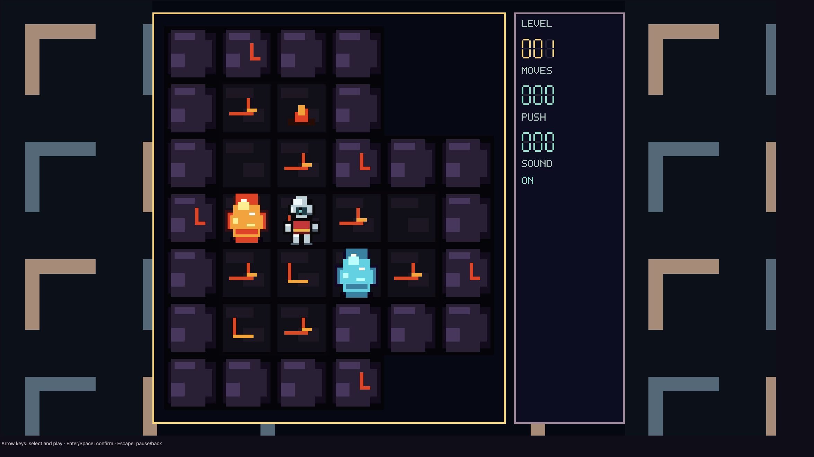
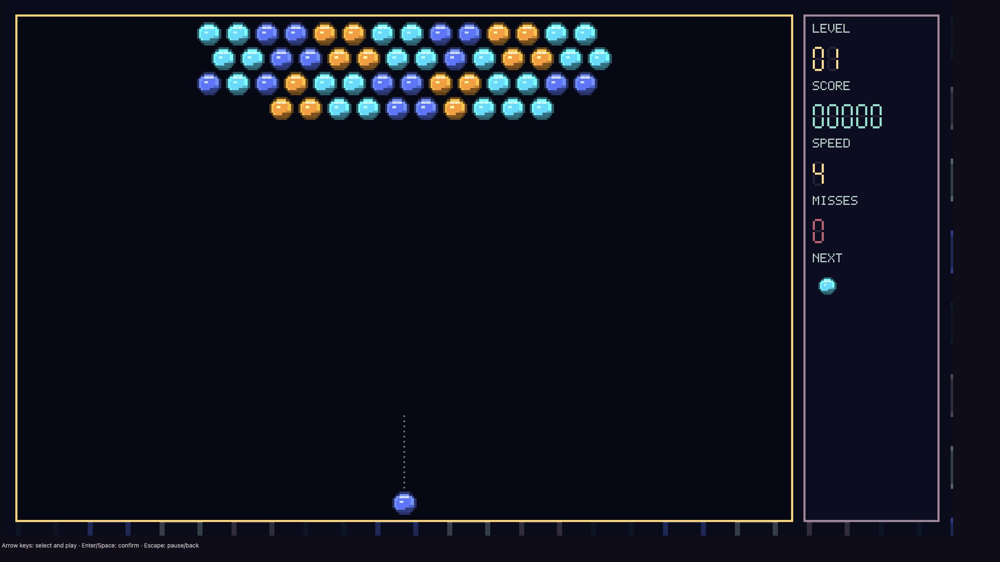

# Peppercade



Peppercade is a compact C++ arcade collection for Samsung TV, macOS, and the
browser. The primary TV backend uses ARM NaCl with Pepper Graphics3D/GLES2;
the same platform-neutral games also run through SDL/OpenGL and
SDL/WebAssembly.

The collection currently includes Stackfall, Brickbound, 2048, Neon Serpent,
Lightline, Dragoban, and Bubble Orbit.

## Games

<table>
  <tr>
    <td width="50%" align="center">
      <strong>Game selector</strong><br>
      
    </td>
    <td width="50%" align="center">
      <strong>Stackfall</strong><br>
      
    </td>
  </tr>
  <tr>
    <td width="50%" align="center">
      <strong>Brickbound</strong><br>
      
    </td>
    <td width="50%" align="center">
      <strong>2048</strong><br>
      
    </td>
  </tr>
  <tr>
    <td width="50%" align="center">
      <strong>Neon Serpent</strong><br>
      
    </td>
    <td width="50%" align="center">
      <strong>Lightline</strong><br>
      
    </td>
  </tr>
  <tr>
    <td width="50%" align="center">
      <strong>Dragoban</strong><br>
      
    </td>
    <td width="50%" align="center">
      <strong>Bubble Orbit</strong><br>
      
    </td>
  </tr>
</table>

## Repository organization

The [engine](engine/src) owns reusable rendering, input, timing, audio, HUD,
effects, and the shared game contract. Every title lives under [games](games)
using its Peppercade public name. Platform shells are isolated under
[platforms](platforms), while [tizen-benchmark](tizen-benchmark) is a TV
performance tool rather than a game.

Dragoban keeps the original Microban I source beside the game in
[games/dragoban/third-party-levels](games/dragoban/third-party-levels).
Its generated table and per-level provenance are documented in
[games/dragoban/LEVELS.md](games/dragoban/LEVELS.md); redistribution terms are
in [THIRD_PARTY_NOTICES.md](THIRD_PARTY_NOTICES.md).

See [ARCHITECTURE.md](ARCHITECTURE.md) for dependency rules and ownership.

## Contributors

Peppercade is maintained by Sergey Bekharsky with assistance from OpenAI Codex.

## Local configuration

Copy `.env.example` to `.env` and set paths for the local Pepper 47 SDK,
Emscripten SDK, SDL2, signing profile, and optional TV connection. The real
`.env` is ignored by Git, so machine-specific paths and device details are not
committed.

```sh
cp .env.example .env
```

## Build

Build and verify every supported target, including macOS, NaCl, WebAssembly,
the checked-in GitHub Pages bundle, and signed TV packages:

```sh
./scripts/build-all.sh
```

Individual entry points are also available:

```sh
./platforms/sdl/build_macos_sdl.sh
./scripts/build-all-nacl.sh
./platforms/sdl/build_wasm.sh
./scripts/build-pages.sh
./scripts/package-all-tv.sh
```

Generated local artifacts are ignored except for `site/`, which is the
versioned GitHub Pages payload deployed by `.github/workflows/pages.yml`.

## Browser build

After `./platforms/sdl/build_wasm.sh`, serve the output locally:

```sh
cd platforms/sdl/build-wasm
python3 -m http.server 8080
```

The published build is available at
[bekharsky.github.io/peppercade](https://bekharsky.github.io/peppercade/).

## License

Peppercade source code is available under the [MIT License](LICENSE).
Third-party level data remains under its respective terms.
